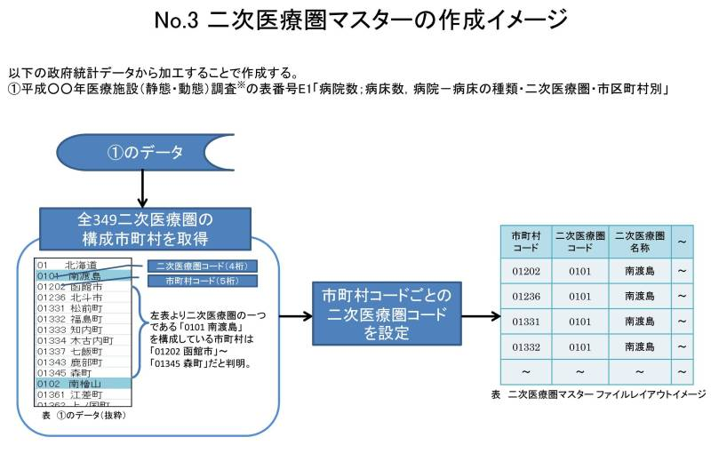

## 2次医療圏

## 2次医療圏コード(4digit)
[政府統計データ](https://www.e-stat.go.jp/stat-search/)よりCSVファイルをダウンロードできる。  
医療施設調査 x年医療施設（静態・動態）調査 > 表番号E1:病院数；病床数，病院－病床の種類・二次医療圏・市区町村別  
4桁が2次医療圏コード、5桁が市町村コードを表す。  

#### 参考(厚生労働省)

## 処理
上記のCSVを加工する。

## Output
{市町村コード(5digit),市町村名,都道府県コード(2digit),都道府県名,2次医療圏コード(4digit),2次医療圏名}
のCSVファイル

